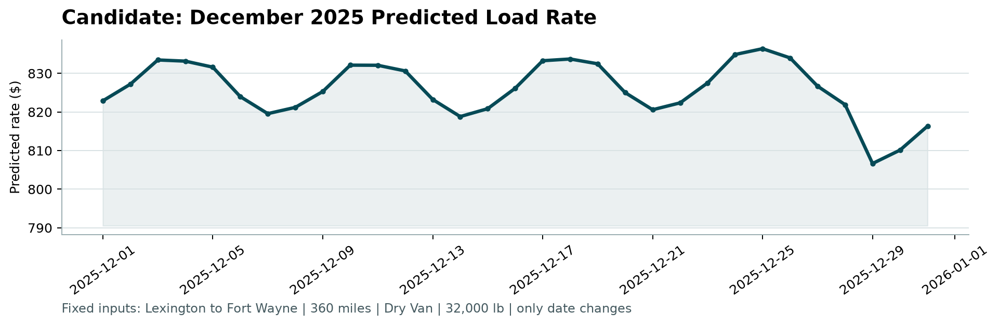

## 1. Summary

The task is to predict freight `posted_rate`. I built two models - a
**full-feature** model for the 12,000 graded validation loads and a **reduced**
model for the fixed December chart - validated them with a **time-based** split,
and submitted an **equal-weight blend** of the three strongest models.

Headline validation numbers (out-of-fold, time-based CV):

| Metric | Value |
|---|---|
| RMSE | **629.3** |
| MAE | **114.3** |
| MAPE | **5.1%** |
| R² | **0.826** |

## 2. Data exploration - key findings

- **48,000** training loads spanning **Jan-Oct 2025**; the validation set is
  **Nov-Dec 2025**. The problem is therefore a *forecast*: predict later months
  from earlier ones.
- **64** pickup cities, **64** delivery cities, **4,014** unique lanes, and
  **3** equipment types (Dry Van 57%, Reefer 25%, Flatbed 18%).
- `posted_rate` ranges **\$57-\$25,533** and is strongly driven by `distance`
  and `market_index`.
- **The pricing is close to linear.** A plain Ridge regression matched or beat
  gradient boosting at baseline - a strong signal that rate is roughly
  `distance × per-mile price`, without severe nonlinearity.

## 3. Data-quality issues and how I handled them

- **Synthetic coordinates.** Each city has exactly one lat/long (no dupes), but
  the coordinates are geographically wrong (e.g. "Los Angeles" is mislocated).
  I computed the straight-line (haversine) distance and found it correlates with
  the provided `distance` at **r = 0.9995** (ratio ≈ 1.18, a plausible road
  detour factor). Conclusion: coordinates are internally consistent but
  **redundant with `distance`**, so I did not rely on them (kept only a
  detour-ratio feature).
- **Weight sign errors.** There are **292 negative weights**. Their magnitudes
  match ordinary weights, so I repaired them with `abs(weight)` and retained
  negative/missing audit indicators as model features.
- **Detached label errors.** A robust equipment + log-distance rate-per-mile
  baseline exposes **677 labels (1.41%)** separated from the main residual
  distribution by a completely empty band. These rows are excluded from model
  fitting only. Every held-out row remains in the reported metrics, so the
  headline score still represents the scorer's all-row evaluation policy.
- **Irreducible noise floor.** Different model families now converge near
  **RMSE ≈ 629-632** (R² ≈ 0.83). When independent models hit the same wall, that
  wall is noise the features cannot explain. I therefore focused gains on
  *proportional* error (MAPE) rather than chasing RMSE.

## 4. Validation approach and data split

I used a **time-based (expanding-window) split**, never a random one - a random
split would leak future information into training and overstate accuracy.

Each fold trains on all earlier months and validates on a single later month,
holding out **August, then September, then October 2025**. This mirrors the real
task (Nov-Dec is unseen future) and gives an honest estimate.

All **target encoding is fitted inside each fold** (train rows only) and applied
to the held-out rows, so no target information leaks across the split.
The label-quality screen is also derived from each training fold only. It never
filters or alters the validation target.

Two separate models are trained because the inputs differ:

| Model | Used for | Columns available |
|---|---|---|
| Full | 12,000 graded loads | all (incl. market_index, quote_signal, coords) |
| Reduced | December chart | only the 6 shared columns |

## 5. Feature engineering

- **Calendar:** month, weekday, day-of-month, week-of-year, weekend & US-holiday
  flags, and smooth seasonal sin/cos of day-of-year (so a future month stays
  in-range for tree models).
- **Numeric:** distance, log-distance, repaired weight, negative/missing-weight
  indicators, weight-per-mile, and interactions (`distance × equipment`, and
  for the full model `distance × market_index`, `distance × quote_signal`).
- **Categorical:** equipment one-hot; **smoothed target encoding** for lane,
  pickup and delivery (leak-safe, fitted within folds).
- **Target framing:** the single biggest win was predicting **log(rate)** - it
  cut MAPE from **8.4% to 5.1%** while RMSE stayed near the noise floor.

## 6. Model bake-off

Roster: Ridge, RandomForest, XGBoost, LightGBM, CatBoost, MLP, and TabPFN
(TabPFN run on Kaggle - see note below). Light Optuna tuning was used on the
strongest candidates. The final comparison below uses the same saved
hyperparameters after the fold-safe data corrections, so the improvement is
attributable to the corrected data path rather than a new search budget.

| Candidate | RMSE | MAE | MAPE |
|---|---:|---:|---:|
| LightGBM | 629.9 | 119.1 | 5.37% |
| CatBoost | 630.1 | 117.1 | 5.31% |
| Ridge | 631.6 | 124.5 | 5.62% |
| XGBoost | 632.3 | 122.5 | 5.51% |
| **Three-model blend** | **629.3** | **114.3** | **5.13%** |

**TabPFN (Kaggle), for completeness.** The assessment machine has no GPU, so
TabPFN ran on Kaggle. Two real constraints applied: the current package gates
its newest weights behind a license token that a non-interactive kernel cannot
accept, and Kaggle's GPU/torch build raised a CUDA kernel-image mismatch - so it
ran on **CPU with a 3,000-row training context**. Under that constraint TabPFN
was **not competitive**: CV RMSE ≈ **1,141**, MAPE ≈ **37%**. This is expected -
TabPFN excels on *small* datasets, whereas this one is large and near-linear, a
regime gradient boosting and linear models capture fully using the complete
training set. It is therefore reported but excluded from the final blend.

## 7. Final model

Per the plan, I compared the best single model against an equal-weight blend of
the top 3 on out-of-fold predictions. The **blend (LightGBM + CatBoost + Ridge)**
won and was refit on the screened training rows to produce
`validation_predictions.csv` (12,000 rows, mean ≈ \$2,375).

## 8. Reproducibility

`uv`-managed, Python 3.11 pinned. Run `uv sync` then
`uv run python -m src.finalize` to regenerate predictions and the chart. See
`README.md` for the full command list and `SPEC.md` for design decisions. Four
focused tests cover weight repair, label screening, training-only row selection,
and the fixed December output schema. The supplied scorer validates all 12,000
submission rows and all 31 December rows.

## 9. December prediction

December is a *future* month, and its file has only 6 columns, so I used the
**reduced CatBoost (log)** model with calendar features. Because the model keys
off weekday and seasonality - not a raw time index - the daily line moves
realistically instead of flatlining.

The clear **weekly cycle** (mid-week peaks, weekend dips, **\$807-\$836**) is the
calendar features at work.
